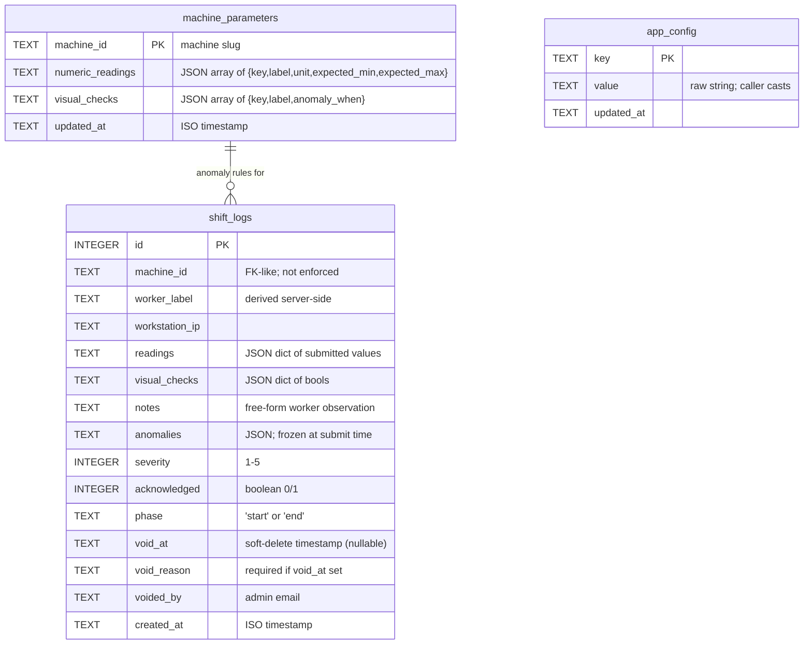

# 02 — Database Schema

> SmartFix uses **three persistence layers** and **one in-memory layer**. Each is documented below with shape, ownership, and durability characteristics.

## Storage overview

| Layer | Purpose | Survives restart? | Backed up? |
|---|---|---|---|
| **ChromaDB** (`./chroma_db/`) | Vector index of manual chunks | ✅ (file) | ❌ — re-ingestable from `data/uploads/` PDFs |
| **SQLite** (`./smartfix.db`) | Machine parameters, shift logs, runtime config | ✅ (file) | ✅ via `scripts/backup_sqlite.sh` |
| **JSONL** (`./data/audit.jsonl`) | Append-only audit log | ✅ (file) | ⚠️ not in backup script — add manually |
| **In-memory** (Python lists/dicts) | Alerts, query log, snoozes, sessions, jobs | ❌ — lost on restart | ❌ |

---

## ER diagram (SQLite)



### Tables — detail

#### `machine_parameters`
- One row per machine. Defines the admin-edited spec that EndShiftModal renders and that `compute_anomalies` uses to score worker submissions.
- `numeric_readings` JSON shape: `[{key, label, unit, expected_min, expected_max}]`.
- `visual_checks` JSON shape: `[{key, label, anomaly_when}]` — `anomaly_when=true` means "ticking the box is bad" (e.g. "Leaks observed"); `false` means "unticking is bad" (e.g. "Vibration normal").
- Seeded on first boot via `_DEFAULT_MACHINE_PARAMS` in `src/api.py` for the 4 demo machines. Existing rows are never overwritten by the seed.
- Schema lives in `src/store.py`; create + migrate is idempotent inside `init_store()`.

#### `shift_logs`
- Append-only. Insertion freezes `anomalies` + `severity` against the parameter spec that was in effect at submit time, so later edits to thresholds don't retroactively change history.
- Soft-delete via `void_at` (set by `POST /admin/shifts/{id}/void` with required reason). Voided rows stay queryable but are filtered out of `latest_shift_log()` so the HandoffBanner skips them.
- Index `idx_shift_logs_machine_created` on `(machine_id, created_at DESC)` for the recent-logs query.
- Migration paths (additive): `phase`, then `void_at` / `void_reason` / `voided_by`. SQLite has no `ADD COLUMN IF NOT EXISTS` so `init_store()` introspects `PRAGMA table_info` and conditionally `ALTER TABLE`s.

#### `app_config`
- Key/value store for admin-tunable runtime settings.
- Currently used keys:
  - `alert_threshold` (int, 1–25, default from `ALERT_THRESHOLD` env)
  - `alert_dedup_seconds` (int, 0–86400, default from `ALERT_DEDUP_SECONDS` env)
- Loaded into module-level globals at boot by `_load_runtime_config()` and re-loaded after every `PATCH /admin/config`. The DB row wins over `.env` when present.

---

## ChromaDB

- **Path**: `./chroma_db/` (single SQLite-backed persistent client, see `src/db.py`).
- **Collection**: `machine_docs` with metric `cosine`.
- **Chunk shape** (one row per chunk):

| Field | Source | Example |
|---|---|---|
| `id` | `{machine_id}_p{page}_c{chunk_idx}` | `IMM-750_p12_c03` |
| `embedding` | `all-MiniLM-L6-v2` (384-dim) | `[…]` |
| `document` | The chunk text | `"E-04 indicates oil pressure low…"` |
| `metadata.machine` | Used as the where-filter on every query | `INJECTION_MOLDING_MACHINE` |
| `metadata.document` | Original PDF filename | `IMM-750.pdf` |
| `metadata.page` | 1-based page number | `12` |
| `metadata.section` | Heuristic section name | `troubleshooting` |

- See [`supplementary/CHUNKING_STRATEGY.md`](supplementary/CHUNKING_STRATEGY.md) for the ingestion algorithm (PDF → docling → chunk → embed → upsert).
- Re-ingestion (`POST /admin/machines/{id}/reingest`) first deletes all chunks where `metadata.machine == machine_id`, then re-runs ingestion against the archived `data/uploads/{machine_id}.pdf`.

---

## `data/audit.jsonl`

- Append-only JSON-lines file. One event per line:

```json
{"action": "machine.delete", "actor": "admin@tecdia.local", "status": "success", "target": "OLD_MACHINE", "ip": "192.168.1.10", "details": {...}, "ts": "2026-05-27T12:41:00+00:00"}
```

- Event categories: `auth.*`, `machine.*`, `shift.*`, `alert.*`, `config.*`.
- Read via `audit.read(limit, action_prefix)` (powers `GET /admin/audit`).
- **Not currently in the backup script** — add a tar of `data/audit.jsonl` alongside the SQLite backup.

---

## In-memory state (`src/api.py`)

> Everything below is **lost on server restart**. P1 hardening should move these to SQLite.

| Variable | Shape | Purpose |
|---|---|---|
| `_alerts` | `list[dict]` | Fired alerts, newest at the end. Capped only by `DELETE /admin/alerts`. |
| `_alert_snoozes` | `{machine_id: ISO-until}` | Per-machine "be quiet" windows. |
| `_query_log` | `list[dict]` | Every `/query` call, used by `/admin/analytics`. FIFO-capped at `QUERY_LOG_MAX = 20000`. |
| `_machine_metadata` | `{machine_id: {display_name, category, significance, icon, description, suggested_questions}}` | Editable metadata that `_list_machines_basic` reads. **Lost on restart** — re-derivable from defaults + PDFs, but admin edits vanish. |
| `_worker_sessions` | `{cookie_value: {domain, machine_id?, workstation_ip?, created_at}}` | 12-hour worker sessions. |
| `_admin_sessions` | `{cookie_value: {email, created_at}}` | 30-day admin sessions. |
| `_magic_tokens` | `{token: {email, expires_at}}` | Single-use sign-in tokens. Popped on verify. |
| `_jobs` | `{job_id: {status, step, progress, ...}}` | Ingestion job state for the progress bar. |

---

## File layout cheat sheet

```
chroma_db/                  # vector index — DON'T edit by hand
smartfix.db                 # SQLite store (gitignored)
smartfix.db-shm             # SQLite WAL shared memory (gitignored)
smartfix.db-wal             # SQLite WAL (gitignored)
data/
  audit.jsonl               # append-only audit log
  uploads/                  # archived machine PDFs
  uploads/icons/            # admin-uploaded custom machine icons
  workstations.json         # IP → machine bindings (manual edit, restart to reload)
```
