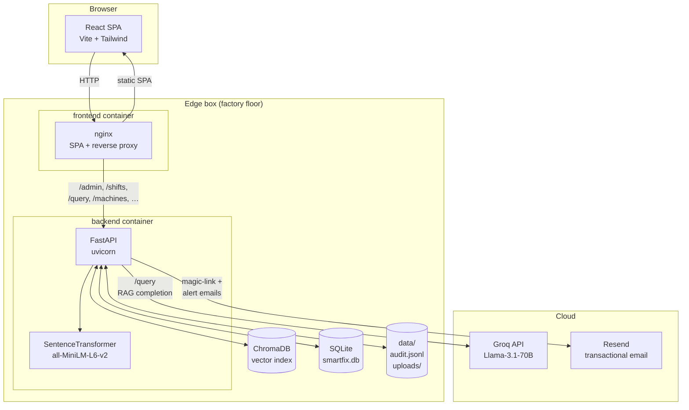
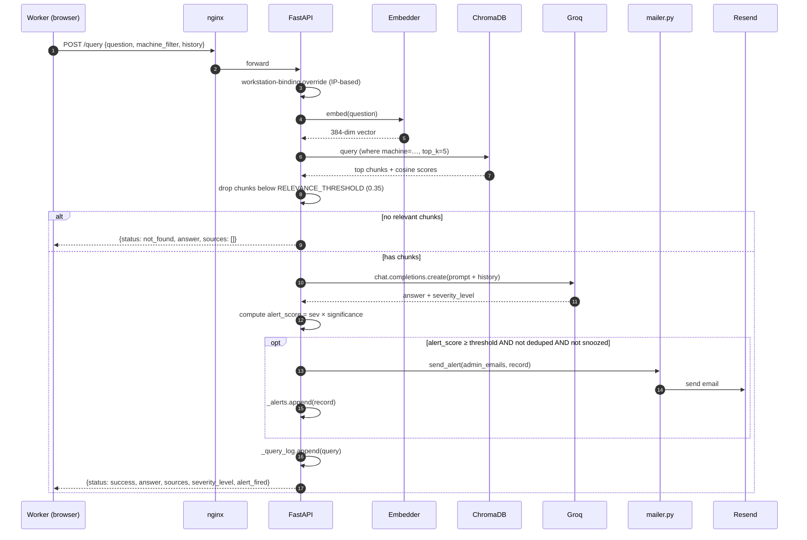
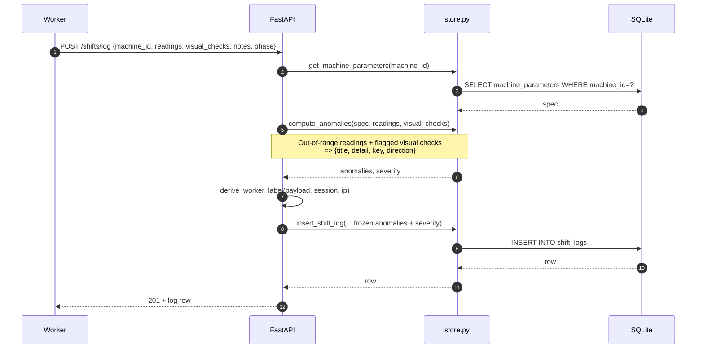
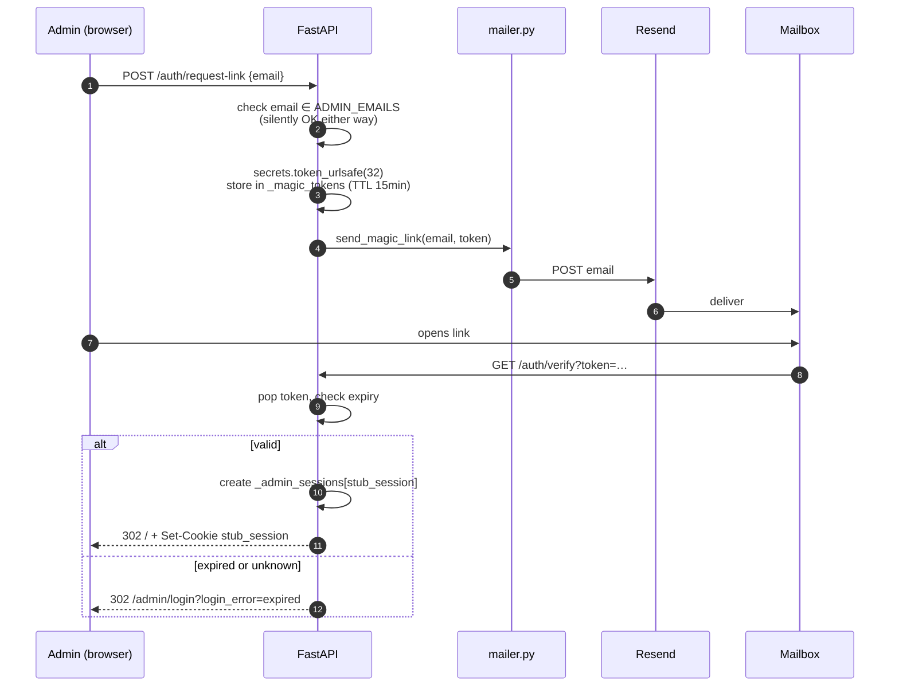
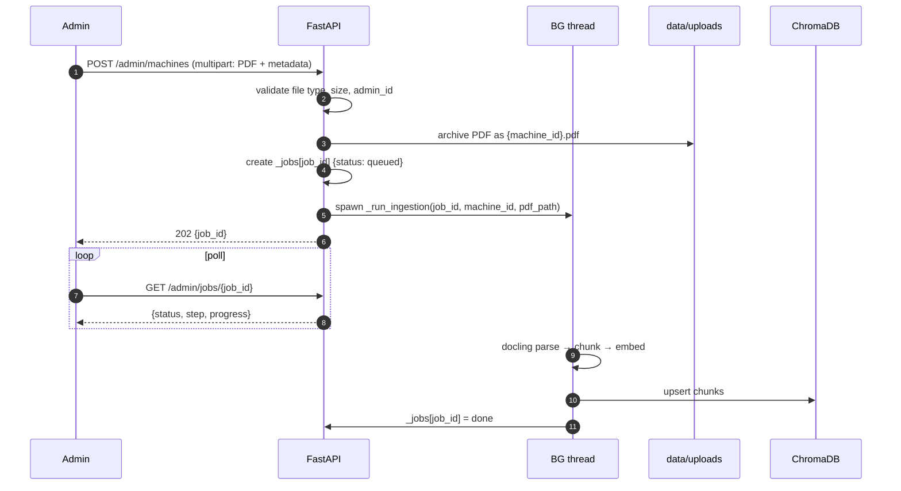

# 03 — System Design

> High-level architecture of SmartFix — what process owns what, how a request flows, and what state lives where.

## Architecture at a glance

### Components in one line each

| Component | Role |
|---|---|
| **React SPA** (`frontend/src/`) | Worker chat UI + admin dashboard. Built by Vite, served by nginx in prod. |
| **nginx** (`frontend/nginx.conf`) | Serves the SPA, reverse-proxies API paths to FastAPI. Matches the Vite dev proxy 1:1. |
| **FastAPI / uvicorn** (`src/api.py`) | The whole backend. All RAG, auth, admin endpoints, and SQLite/Chroma access live here. |
| **SentenceTransformer** | Local embedder; runs in-process inside the FastAPI worker. ~80 MB resident. |
| **ChromaDB** | Persistent vector index for manual chunks. File-backed at `./chroma_db/`. |
| **SQLite** | Machine parameters, shift logs, app config. WAL mode, per-thread connections. |
| **Groq** | Hosted Llama for the completion step of RAG. Only required for `/query`. |
| **Resend** | Magic-link sign-in + alert emails. Optional — backend degrades gracefully if not configured. |

---

## Request flows

### 1. Worker asks a question (`POST /query`)

### 2. Worker submits an end-of-shift log (`POST /shifts/log`)

### 3. Admin signs in (magic link)

### 4. Admin ingests a new machine

---

## State + lifecycle

### What survives a restart

✅ **Survives**: `chroma_db/`, `smartfix.db`, `data/audit.jsonl`, `data/uploads/*.pdf`, `data/uploads/icons/*`.

❌ **Lost**: `_alerts`, `_query_log`, `_alert_snoozes`, `_machine_metadata` admin-edits, `_worker_sessions`, `_admin_sessions`, `_magic_tokens`, `_jobs`.

This is the **P1 hardening gap**: alerts and query analytics need to be persisted to SQLite to survive a restart.

### Boot sequence (`lifespan` in `src/api.py`)

1. Load the SentenceTransformer model (~5 s on cold disk, faster on warm cache).
2. Open the ChromaDB persistent client.
3. Load `data/workstations.json` into `workstations._bindings`.
4. `store.init_store()` — create SQLite tables + apply additive migrations.
5. `store.seed_machine_parameters(_DEFAULT_MACHINE_PARAMS)` — only for machines that don't already have a row.
6. `_load_runtime_config()` — merge `app_config` DB rows on top of env-default `ALERT_THRESHOLD` / `ALERT_DEDUP_SECONDS`.

---

## Deployment model

**Target**: a single edge box per factory (i.e. no cloud control plane, no multi-tenant). Air-gapped operation works for everything except `/query` (Groq) and outbound emails (Resend).

**Compose stack** (`docker-compose.yml`):
- `backend` — Python 3.11 + uvicorn, exposes `:8000`, mounts three named volumes (`chroma_db`, `data`, `sqlite_store`).
- `frontend` — Node 22 multistage build → nginx alpine. Exposes `:80` on host. Depends on backend healthcheck.
- Both services on a private network; only `frontend` is reachable from the LAN.

**Backups**: `scripts/backup_sqlite.sh` runs nightly via cron — WAL-safe `sqlite3 .backup`, integrity check, 14-day rotation. **Does NOT currently cover** `chroma_db/` or `data/audit.jsonl` — both should be added to the backup procedure before a real factory deploy.

---

## Security boundaries

- **Admin auth**: `require_admin` FastAPI dependency on every `/admin/*` route. Direct `curl` without `stub_session` cookie → 401.
- **Worker auth**: `worker_session` cookie, HttpOnly, SameSite=Lax. Missing `Secure` flag in prod — add when TLS-terminating.
- **Magic-link tokens**: single-use, 15-min TTL, popped on verify.
- **CORS**: dev-permissive (`http://localhost(:\d+)?` regex). Production sits behind the nginx reverse proxy on the same origin, so CORS doesn't apply.
- **Static files**: only `data/uploads/icons/` is mounted publicly. PDFs in `data/uploads/` are NOT exposed.
- **CSP**: not currently set in `frontend/nginx.conf`. Recommended hardening.
